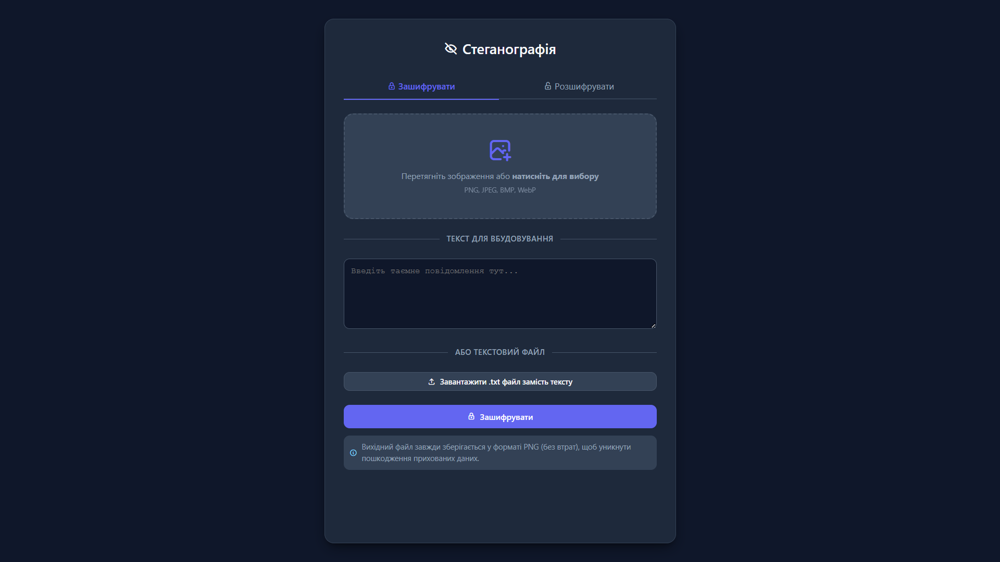

# 🔐 Steganography Tool (Інструмент стеганографії)

Сучасний, швидкий та конфіденційний веб-інструмент для вбудовування текстових повідомлень у зображення (і навпаки) за допомогою алгоритму **LSB (Least Significant Bit)**. 

Уся обробка відбувається локально у вашому браузері за допомогою JavaScript Canvas API — жодне зображення чи текст не передаються на сервер.

▶️ **[ЖИВИЙ ДЕМО-САЙТ (Встав посилання на свій GitHub Pages або Vercel тут)]**

---

## ✨ Особливості (Features)

* 🌗 **Сучасна темна тема** — мінімалістичний та приємний для очей інтерфейс у темних тонах.
* 🔒 **Повна конфіденційність** — робота на клієнтській стороні (без бекенду).
* 📝 **Два способи введення** — ручне введення тексту або завантаження готового файлу (`.txt`, `.md`, `.json` тощо).
* 🖼️ **Підтримка форматів** — приймає формати PNG, JPEG, BMP, WebP для шифрування.
* 📦 **Без втрат якості** — фінальний результат завжди зберігається у форматі **PNG** без стиснення, щоб зберегти приховані дані.
* 📱 **Адаптивний дизайн** — коректно відображається на смартфонах та ПК.

---

## 🚀 Технологічний стек (Tech Stack)

* HTML5 / CSS3 (Сучасні CSS змінні, Flexbox, CSS Grid)
* JavaScript (Vanilla JS, Canvas API, FileReader API, TextEncoder/TextDecoder)
* [Tabler Icons](https://tabler.io/icons) — для стильних іконок.

---

## 🛠️ Як це працює (Коротко)

Програма використовує метод **найменш значущого біту (LSB)**. Вона розкладає зображення на пікселі, а кожен піксель — на колірні канали (Червоний, Зелений, Синій). Наймолодший (останній) біт у байті кольору замінюється на біт секретного повідомлення. Оскільки зміна кольору становить всього $\pm1$ одиницю (наприклад, яскравість зміниться з 255 на 254), людське око фізично не здатне помітити різницю на картинці.

---

## 📦 Як запустити локально

Оскільки проєкт не має залежностей і бекенду, запустити його максимально просто:

1. Склонуйте репозиторій:
   ```bash
   git clone https://github.com/BlackPencil-69/Steganography-Tool.git
   ```

2. Відкрийте файл `index.html` у будь-якому браузері (подвійним кліком).

---

## 📝 Ліцензія

Цей проєкт поширюється під ліцензією MIT. Ви можете вільно використовувати, копіювати та модифікувати його.
   
